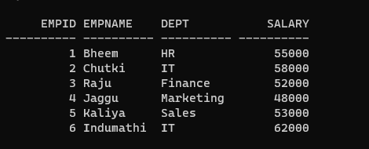

# Ex. No: 6 Creating Cursors using PL/SQL

### AIM: To create a cursor using PL/SQL.

### Steps:
1. Create employee table with following attributes (empid NUMBER, empname VARCHAR(10), dept VARCHAR(10),salary NUMBER);
2. Create a cursor named as employee_cursor
3. Using cursor read each record and display the result
4. Close the cursor

### Program:
### Create employee table
```sql
CREATE TABLE employee (empid NUMBER, empname VARCHAR2(10), dept VARCHAR2(10), salary NUMBER);
```
### PLSQL Cursor code
```sql
DECLARE
emp_id NUMBER;
  emp_name VARCHAR(10);
  emp_dept VARCHAR(10);
  emp_salary NUMBER;

  CURSOR employee_cursor IS
    SELECT empid, empname, dept, salary
    FROM employee;

BEGIN

  OPEN employee_cursor;


  LOOP
    FETCH employee_cursor INTO emp_id, emp_name, emp_dept, emp_salary;
    EXIT WHEN employee_cursor%NOTFOUND;
    

    DBMS_OUTPUT.PUT_LINE('Employee ID: ' || emp_id || ', Employee Name: ' || emp_name
    || ', Department: ' || emp_dept || ', Salary: ' || emp_salary);
  END LOOP;


  CLOSE employee_cursor;
END;
/
```
### Output:




```python
SUBMITTED BY :
NAME : SATHISH R
REGNO: 212222100048
```

### Result:
Thus, the Cursor is created using PL/SQL Successfully.
